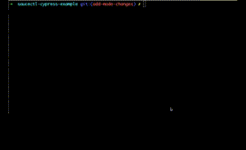

# saucectl cypress example

Example running saucectl with cypress.

## What You'll Need

The steps below illustrate one of the quickest ways to get set up. If you'd like a more in-depth guide, please check out
our [documentation](https://docs.saucelabs.com/testrunner-toolkit/installation).

### Install `saucectl`

```shell
npm install -g saucectl
```

### Set Your Sauce Labs Credentials

```shell
saucectl configure
```

## Running The Examples

Simply check out this repo and run the command below :rocket:

3 test suites are being triggered in `docker` and `sauce` mode. `saucectl` will run the suites marked as `docker` mode firstly and then run the suites which are marked as `sauce` mode.

```bash
saucectl run
```



## The Config

[Follow me](.sauce/config.yml) if you'd like to see how saucectl is configured for this repository. 

## More Examples?

We have more examples in the [examples](examples) folder :file_folder:
